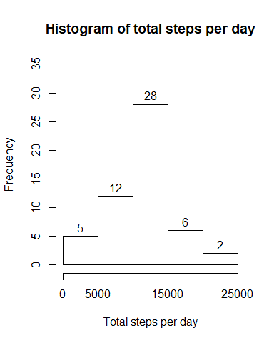
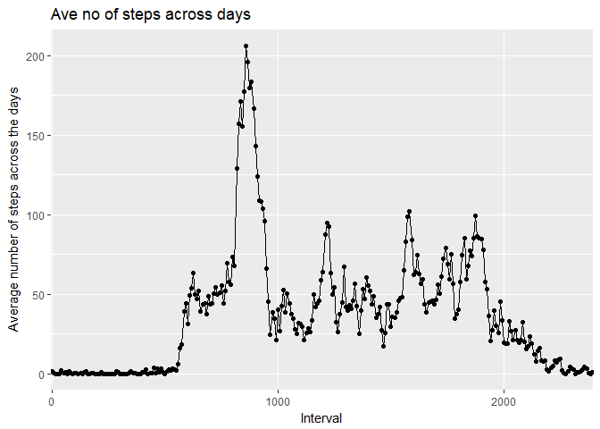
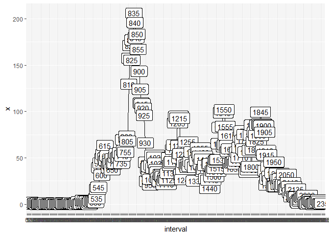
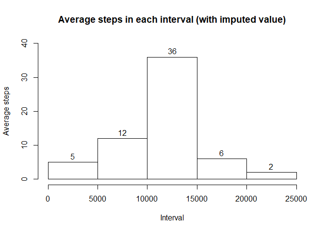
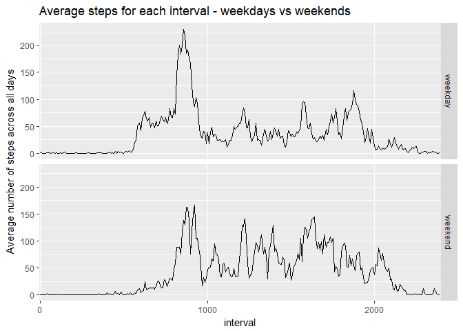

## Loading and preprocessing the data
Load up the required library


```r
library(ggplot2)
```

```
## Warning: package 'ggplot2' was built under R version 3.4.3
```

```r
library(dplyr)
```

```
## 
## Attaching package: 'dplyr'
```

```
## The following objects are masked from 'package:stats':
## 
##     filter, lag
```

```
## The following objects are masked from 'package:base':
## 
##     intersect, setdiff, setequal, union
```

Read the data from "activity.csv" file. Ensure that "activity.csv"" is located in the same directory as your R Markdown file !


```r
data <- read.csv("activity.csv")
```


## What is mean total number of steps taken per day?

Calculate the total number of steps taken each day


```r
stepsperday <- with(data, tapply(steps,date,sum))
```

Generate a histogram to show the total number of steps taken each day and report the mean and median


```r
hist(stepsperday, labels = TRUE, ylim = c(0,35))
```

<!-- -->

Step count between 10,000 to 15,000 


```r
summary(stepsperday)
```

```
##    Min. 1st Qu.  Median    Mean 3rd Qu.    Max.    NA's 
##      41    8841   10765   10766   13294   21194       8
```

Mean number of steps per day = 10,766 
Median number of steps per day = 10,765

## What is the average daily activity pattern?

Convert data$interval to a factor


```r
data$interval <- as.factor(data$interval)
```

Work out the average steps for each 5 min interval , across the days


```r
ave <- aggregate(data$steps, by=list(interval = data$interval), FUN = mean, na.rm = TRUE)
```

Plot interval vs ave number of steps across the days


```r
aveplot <- ggplot(data = ave, aes(x = interval,y = x, group = 1))
ggplot(data = ave, aes(x = interval,y = x, group = 1)) + geom_line() + geom_point()  + xlab("Interval") + ylab("Average number of steps across the days")
```

<!-- -->

Insert labels indicating the interval at each point, this will allow us to 'eyeball' which interval has the highest avereage steps


```r
aveplot+ geom_line() + geom_label(aes(label=interval),label.size = 0.01)
```

<!-- -->

To be more precise, we search through ave to identify the interval with the highest number of steps


```r
ave[which.max(ave$x),]
```

```
##     interval        x
## 104      835 206.1698
```

From which we get 835th minute interval at 206 steps 

## Imputing missing values


```r
sum(is.na(data$steps))
```

```
## [1] 2304
```

From the results above there are 2304 NA values


```r
data2 <- data
```

```r
##loop through data2, 
for (i in 1:nrow(data2)){
    ## if we encounter a NA value in "steps"
    if (is.na(data2[i,"steps"])){
       ##Get the interval
       I <- data2[i,"interval"] 
       ##look up ave and get the row that correspond to the same interval
       aveRow <- which(ave$interval == I)
       ## replace the "steps" value in data for that interval with the average steps of the same interval from ave
       data2[i,"steps"] <- ave[aveRow,"x"]
    }

}
```


```r
stepsperday2 <- with(data2, tapply(steps,date,sum))
hist(stepsperday2, labels = TRUE, ylim = c(0,40))
```

<!-- -->

```r
summary(stepsperday2)
```

```
##    Min. 1st Qu.  Median    Mean 3rd Qu.    Max. 
##      41    9819   10766   10766   12811   21194
```

Slightly higher max frequency for the 10,000 to 15,000 steps interval on the histogram. Other than that the impact of imputing missing values by using the average across all the days, is minimal

## Are there differences in activity patterns between weekdays and weekends?


```r
WD<- weekdays(as.Date(data$date))
W <- vector(mode = "character", length = 17568)
```


```r
##loop through data2, 
for (j in 1:length(WD)){
    ## if we encounter a NA value in "steps"
    if (WD[j] == "Monday" | WD[j] == "Tuesday" |WD[j] == "Wednesday" | WD[j] == "Thursday" | WD[j] == "Friday"){
       W[j] <- "weekday"
    }
  
    if (WD[j] == "Saturday" | WD[j] == "Sunday"){
      
      W[j]<- "weekend"
    }

}
```


```r
data2 <- mutate(data2, Weekday = as.factor(W))
ave2<- aggregate(data2$steps, by=list(interval = data2$interval, day = data2$Weekday), FUN = mean, na.rm = TRUE)
ave2$x <- round(ave2$x, digits = 1)
```


```r
ggplot(data = ave2, aes(x = interval, y = x, group = day)) + geom_line() + facet_grid(day~.) + scale_x_discrete(breaks = c(0,1000,2000,3000)) + ylab("Average number of steps across all days")
```

<!-- -->

From the plots, weekday activity tend to start earlier, while weekend activity tend to end later
